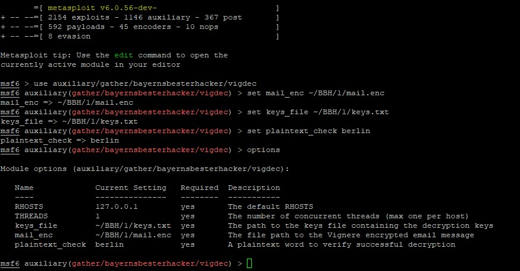
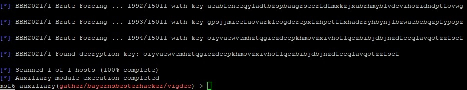

# Bayerns Bester Hacker 2021 / Challenge 1


## Briefing

Herzlich willkommen zur Challenge „Bayerns bester Hacker“!

Mit deiner Registrierung hast du bereits den ersten Schritt erfolgreich gemeistert und hast hiermit die „Lizenz zum Hacken“.

Bevor es los geht, noch ein paar Regeln:

Wir verstehen uns als ethische Hacker. Im Zuge des Wettbewerbs können unter anderem Handlungen ausgeführt werden, die, wenn sie nicht mit der Einwilligung des Betreibers geschehen, gegen geltende Gesetze verstoßen können. Daher sind die Aufgaben ausschließlich auf den von uns bereitgestellten Systemen oder eigenen Testumgebungen zu lösen.

Denn im Gegensatz zu Hackern mit kriminellen Absichten sind wir ethische Hacker und nutzen unsere Fähigkeiten um Sicherheitslücken zu schließen, bevor diese ausgenutzt werden können.

Im Zuge der Aufgaben wirst du mit der Kanzlei RAe Schmitt in Kontakt kommen. Dies ist eine rein fiktive Kanzlei.

Nun kann es los gehen mit der ersten Aufgabe:

Wir konnten eine E-Mail vom Administrator der Kanzlei RAe Schmitt abfangen (siehe Anhang).

Leider ist die Email verschlüsselt.

Wir wissen jedoch, dass der Administrator von RAe Schmitt manchmal etwas überfordert ist und einige Konzepte der IT-Sicherheit nicht komplett verstanden hat.

Schau dich doch mal auf https://rae-schmitt.de/ um. Hinweis: Zur Lösung der Aufgabe muss keine Schwachstelle ausgenutzt werden.

Zur erfolgreichen Lösung der Aufgabe erwarten wir von dir Folgendes:
- Das Geheimnis aus der Mail
- Eine detailierte Beschreibung deines Lösungsweges
- (Selbst entwickelte) Tools, die du zum Lösen der Aufgabe genutzt hast

Die nächste Aufgabe erhältst du frühestens ab dem 09.08.2021, wenn du die richtige Lösung unter challenge@bayerns-bester-hacker.de bei uns eingereicht hast. Über diese E-Mail Adresse kannst du uns auch deine Fragen stellen.
Um dich für die nächste Runde zu qualifizieren, muss die Lösung bis spätestens 11.08.2021 bei uns eingehen.

Wir wünschen dir viel Spaß und freuen uns auf deine Lösung.
Mit freundlichen Grüßen,

Dein Challenge-Team von Bayerns Bester Hacker


## Update: Offizieller Lösungsweg

[](https://www.youtube.com/watch?v=1d-DR7cK_HQ)


## Mein Lösungsweg

1. Die Angaben aus der Email gelesen und den Anhang grob überflogen. Die mail.enc sieht im ersten Moment wie eine Zeichenverschiebung (ala Rot-13) aus.
2. Der Hinweis zur Website hat mich zur [robots.txt](https://rae-schmitt.de/robots.txt) gebracht, die u.a. das Unterverzeichnis [/keys/](https://rae-schmitt.de/keys/) vor Suchmaschinen blockiert.
3. Nicht wissend, welche Keys (oder ein Key, bspw. TLS oder GPG) das ist, habe ich die Liste kopiert und gespeichert. Bei einem zweiten Blick in den Quellcode fiel mir sofort der Hinweis auf vig-enc und damit wahrscheinlich den Vigenère Cipher auf (auch Zeichenverschiebung)
4. Den Cipher habe ich auch lange per Brute Force durchprobiert, bin aber noch auf keinen Klartext gekommen. Ein Gespräch mit @JonasMArnold hat mich dann auf den Fehler hingewiesen, der aber auch im Quellcode versteckt ist. Zwar geht es um a-z als Alphabet und Groß-Kleinschreibung macht einen Unterschied (in meinem Fall das suchen nach case-sensitivem Suchen "Berlin" vs. "berlin")

5. Das gelöst, habe ich die 15010 Keys durchprobiert und den Schlüssel *oiyvuewvemhztqgiczdccpkhmovzxivhoflqczbibjdbjnzdfccqlavqotzzfscf* identifiert.


Der gibt die Email von  **aurelius mueller <a.mueller@rae-schmitt.de>** mit **subject: server zugang** und dem SSH-Private Key an Max Schmitt frei.

## Metasploit

Für den Vigenère Cipher und die Challenge habe ich in /auxiliary/gather ein Metasploit-Modul geschrieben. Benutzer-spezifische Module werden im Homeverzeichnis abgelegt, an diesem Beispiel hier:
```
~/.msf4/modules/auxiliary/gather/bayernsbesterhacker/vigdec.py
```

Das Skript erwartet die folgenden Parameter als `options`:
* `mail_enc` mit absolutem Pfad zur Zieldatei (bspw. /home/pw/BBH/1/mail.enc aus Anhang des Briefings)
* `keys_file` mit absolutem Pfad zur Textdatei mit einem Key pro Zeile ([keys.txt](siehe hier))
* `plaintext_check` wird im regulären Ausdruck verwendet, um auf ein bekanntes Wort im Klartext zu prüfen, wie `charset` oder aber auch `charset|berlin|schmitt|date|anwalt`
