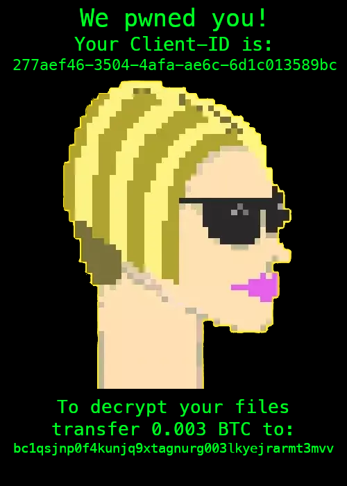
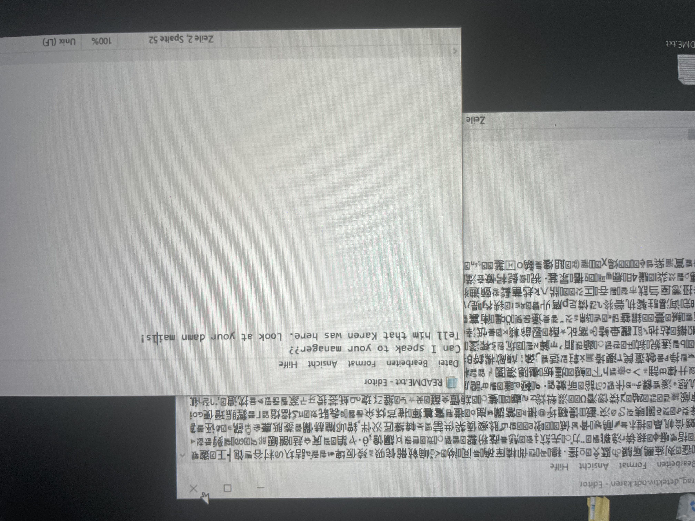

# Bayerns Bester Hacker 2021 / Challenge 2

## Briefing

Herzlich willkommen zur zweiten Aufgabe von „Bayerns bester Hacker“!

Das Firmennetzwerk der RAe Schmitt wurde angegriffen und mehrere Clients sind jetzt verschlüsselt (Siehe Foto im Anhang).

Von den Angreifern hat die RAe Schmitt folgende Nachricht erhalten:

Wir haben die Festplatten des zuerst infizierten Clients von Leonardo Maier exportiert und unter https://share.wlh.io/l/34ba2ada-bbb1-47d0-be33-808f6af5b1c0 bereitgestellt.
Zum Download des Abbilds musst du bitte deinen Namen und deine Email-Adresse hinterlegen.
Das Abbild des Systems liegt als .raw-Datei mit folgender sha256sum vor:
dd49b35847c61c3be75452d82dbfac8ecb5fa9ceda2a04562c32d8c67058ade2 client.raw
Falls es beim Download der Datei Probeme gibt sag uns bitte kurz Bescheid.

Leider hat der Administrator der RAe Schmitt erneut seine Inkompetenz bewiesen und keine Offline-Backups erstellt.

Zur erfolgreichen Lösung der Aufgabe erwarten wir von dir einen kurzen Bericht in dem folgende Fragen geklärt werden:
- Wie wurde das Netzwerk der RAe Schmitt infiziert?
- Was haben die Angreifer auf den Systemen der RAe Schmitt gemacht?
- Können Daten oder Teile der Daten wiederhergestellt werden? Bitte lass uns eine entschlüsselte Datei zukommen.
Wir bewerten dabei auch deine Herangehensweise und die Qualität deiner Dokumentation.

Achtung: Bitte führe keine Anwendungen, die du auf dem infizierten Client findest, auf deinem System aus. Dateien könnten unwiderruflich verloren gehen.
Wir empfehlen für die Untersuchung des Festplatten-Abbilds die Verwendung von virtuellen Maschinen.

Die nächste Aufgabe erhältst du frühestens ab dem 18.08.2021, wenn du die richtige Lösung unter challenge@bayerns-bester-hacker.de bei uns eingereicht hast. Über diese E-Mail Adresse kannst du uns auch deine Fragen stellen.
Um dich für die nächste Runde zu qualifizieren, muss die Lösung bis spätestens 20.08.2021 bei uns eingehen.

Wir wünschen dir viel Spaß und freuen uns auf deine Lösung.
Happy Hacking!

Dein Challenge-Team von Bayerns Bester Hacker

## Lösung

1. ... 
2. ...
