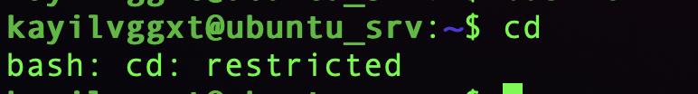

# Bayerns Bester Hacker 2021 / Challenge 3


## Briefing

Du hast es geschafft! Hier ist Aufgabe 3 von Bayerns Bester Hacker.

Das Netzwerk der RAe Schmitt wurde nach dem Ransomware-Vorfall komplett neu aufgesetzt.
Der Administrator Aurelius Müller hat jedoch weiterhin Schwachstellen im neuen Netzwerk.
Finde die Schwachstellen und beweise die Ausnutzung der Schwachstellen, indem du dein Vorgehen erläuterst, ein Passwort des Administrators A. Müller und den ältesten Fall der Kanzlei angibst.
Zusätzlich gibt es noch eine Flag, die du finden und abgeben kannst.

Im Zuge der vorherigen Aufgaben hast du Hinweise gefunden, die dir kombiniert für Aufgabe 3 eine Start-Hilfe geben.
Bitte beachte, dass du auf den Systemen nicht immer alleine sein wirst.
Für Fragen und Probleme zur Aufgabe stehen wir gerne bereit.

Happy Hacking!
Dein Challenge-Team von Bayerns Bester Hacker!


## Lösung

### Vorbereitung

Das Briefing deutet auf Hinweise aus den ersten zwei Challenges hin:
* [Challenge 1](../Challenge1) lässt als Artifakt den [SSH-Key](../Challenge1/ssh.key) über
* [Challenge 2](../Challenge2) hat gleich drei Hosts zur Auswahl:
  * ```DESKTOP-BÜRO1.rae-schmitt.de``` den Desktop-PC des Users l.maier
  * ```win-horcue9m4ld.rae-schmitt.de``` den Domain-Controller des internen Netzwerks
  * ```93.90.206.205``` den Backup-Host aus der sichergestellten Datei [backup.sh](../Challenge2/277aef46-3504-4afa-ae6c-6d1c013589bc/backup.sh)


### Analyse

Zuerst werden die beiden internen Systeme auf ihre Verfügbarkeit überprüft und beide lösen sich als Webserver unter ```h02.wlh.io``` auf. Damit fallen sie vorerst aus der näheren Betrachtung.
```
$ ping DESKTOP-BÜRO1.rae-schmitt.de
PING xn--desktop-bro1-llb.rae-schmitt.de (213.190.30.57): 56 data bytes
$ ping win-horcue9m4ld.rae-schmitt.de
PING win-horcue9m4ld.rae-schmitt.de (213.190.30.57): 56 data bytes
```

Das Backup-Script nutzt einen User ```kayilvggxt``` und Host ```93.90.206.205```. Ein Ping zur Kontaktaufnahme wird blockiert, daher wurde der offene SSH-Port mit [nmap](https://nmap.org/) überprüft und sichergestellt. Ein Login mit dem [SSH-Key](../Challenge1/ssh.key) aus [Challenge 1](../Challenge1) funktioniert und gibt folgende Meldung aus:

```
$ ssh -i ../Challenge1/ssh.key kayilvggxt@93.90.206.205
Mitteilung:
Hallo Mitarbeiter und Mitarbeiterinnen,

wir haben unseren Server umgezogen.
Dieser ist unter http://fileshare.rae-schmitt.ddnss.de/ zu erreichen.
Die Nutzung ist wie gewohnt möglich.

Mit freundlichen Grüßen
A. MüllerConnection to 93.90.206.205 closed.
```

Das Webinterface begrüßt uns mit einer Datei-Upload Maske, die nach einem ersten Test immer fehl schlägt. Zusätzlich ist der Webserver interessant, da vielleicht weitere Services darauf laufen. Ein weiterer Scan mit nmap bestätigt dies:
```
sudo nmap -P0 -sV -p1-65535 -O fileshare.rae-schmitt.ddnss.de
[sudo] password for pw:
Starting Nmap 7.80 ( https://nmap.org ) at 2021-08-22 07:45 UTC
Stats: 0:00:14 elapsed; 0 hosts completed (1 up), 1 undergoing SYN Stealth Scan
SYN Stealth Scan Timing: About 6.58% done; ETC: 07:49 (0:03:19 remaining)
Nmap scan report for fileshare.rae-schmitt.ddnss.de (46.251.251.66)
Host is up (0.015s latency).
Not shown: 65531 filtered ports
PORT     STATE SERVICE  VERSION
22/tcp   open  ssh      OpenSSH 7.6p1 Ubuntu 4ubuntu0.5 (Ubuntu Linux; protocol 2.0)
80/tcp   open  http     nginx
443/tcp  open  ssl/http nginx
4444/tcp open  ssl/http Apache httpd
Warning: OSScan results may be unreliable because we could not find at least 1 open and 1 closed port
Device type: general purpose
Running (JUST GUESSING): Linux 4.X|2.6.X|3.X (92%)
OS CPE: cpe:/o:linux:linux_kernel:4.0 cpe:/o:linux:linux_kernel:2.6.32 cpe:/o:linux:linux_kernel:3.10
Aggressive OS guesses: Linux 4.0 (92%), Linux 2.6.32 (92%), Linux 2.6.32 or 3.10 (92%), Linux 4.4 (92%), Linux 2.6.32 - 2.6.35 (88%), Linux 2.6.32 - 2.6.39 (87%), Linux 2.6.32 - 3.0 (85%)
No exact OS matches for host (test conditions non-ideal).
Service Info: OS: Linux; CPE: cpe:/o:linux:linux_kernel
```


#### File Share


#### SSH-Host

Der obige Scan legt einen SSH-Zugang offen, den ich wieder mit dem SSH-Key und User aus den vorherigen Challenges teste. Der Hinweis im vorherigen Login-Banner, dass alles ist wie vorher, bestätigt die Annahme:

```
$ ssh -i ../Challenge1/ssh.key kayilvggxt@fileshare.rae-schmitt.ddnss.de
The authenticity of host 'fileshare.rae-schmitt.ddnss.de (46.251.251.66)' can't be established.
ECDSA key fingerprint is SHA256:xjcKp7/CsiKn/Cb6Y8b0FEdcVjqUS8mFHpzg3+ZND6w.
Are you sure you want to continue connecting (yes/no/[fingerprint])? yes
Warning: Permanently added 'fileshare.rae-schmitt.ddnss.de,46.251.251.66' (ECDSA) to the list of known hosts.
kayilvggxt@ubuntu_srv:~$
```

**Hinweis:** Die bisher eingeloggten User und zufälligen Usernames deuten auf weitere Teilnehmer der Challenge hin und werden mit den Hosts nicht in Betracht gezogen.



```
kayilvggxt@ubuntu_srv:~$ cd 
bash: cd: restricted
```


# Fazit


# Parkplatz

